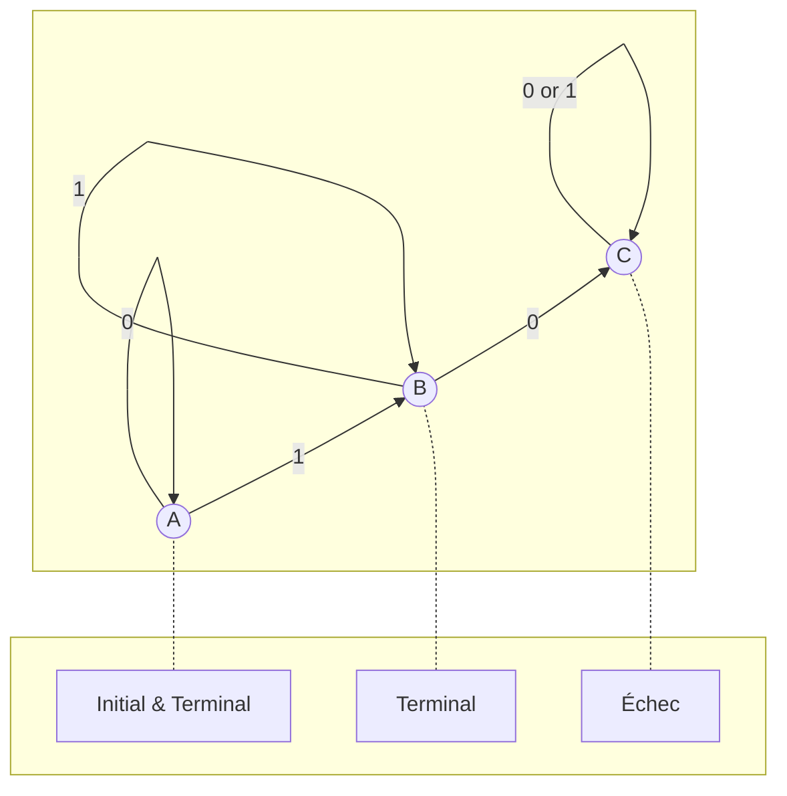

#IN/IN1 
# TD 1
10/01/2023 - 16:00–18:00
## ProLog
ProLog, pour Programmation Logique, par Alain Colmerauer

Une seule structure de données : les arbres, appelés des termes, avec des variables :
- Variable ou \_Variable
- a, 1, 7.8, bonjour... des constantes
- termes composés, aussi appelés foncteurs : f(1,X,g(2,Y))

Une opération : l'unification. "Deux arbres peuvent-ils être rendus égaux ? Si oui, retourner la substitution."

Listes :
- \[\] : liste vide, constante
- \[X|Reste\] : liste non-vide

## Exemples
### Longueur d'une liste.

```ProLog
longueur([], 0).
longueur(\[X|Reste\], N) :- longueur(Reste, M), N is M+1
```

### Membre d'une liste
```ProLog
membre(X,\[X|Reste\]).
membre(X,\[Y|Reste\]) :- membre(X,Reste)
```

### Concaténation de deux listes
L1 = \[1,2\]
L2 = \[3,4,5\]
C = \[1,2,3,4,5\]

```ProLog
concat([],L2,L2).
concat([Head|Tail],L2,[Head|L3]) :-
concat(Tail,L2,L3).
```

## Exemple d'utilisation
```bash
swipl
[premierPas].
listing([longueur,membre,concat]).
membre(1,L). ; ; ; ; ;
```

## Automate d'état fini
Pour l'automate suivant :


```
```
```ProLog
initial(a).
terminal(a). terminal(b).

delta(a,0,a).
delta(a,1,b).
delta(b,0,c).
delta(b,1,b).
delta(c,0,c).
delta(c,1,c).

accepte(C) :-
    initial(Q0),
    deltaStar(Q0,C,Qt),
    terminal(Qt).

deltaStar(Q,[],Q).
deltaStar(Q1,[X|Reste],Q2) :-
    delta(Q1,X,Q),
    deltaStar(Q,Reste,Q2).
```