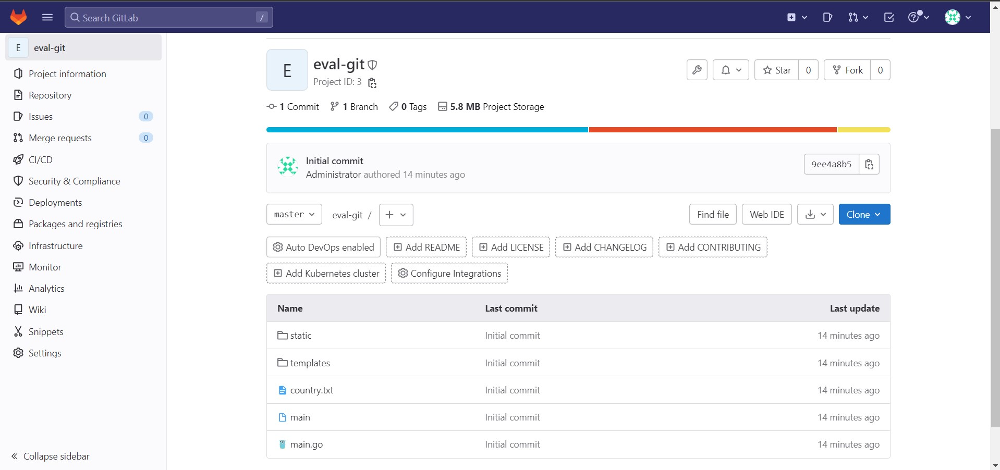

#IN/IN8
# Evaluation
17/02/2023, 10:00–13:00

## Introduction

Groupes : 14  
Noms et Prénoms : Lelay Jules

## Mettre en œuvre un server git nommé eval-git et versionner le projet (2 points)

## Mise en place des tests unitaire sur la machine d’evaluation et versionning (4 points)

## Mise en place d'une documentation du code, la versionner et la rendre disponible sur le port 1234 (2 point)

## Mis en place des tests fonctionnels et les intégration aux tests (3 points)

## Faire une archive Debian automatiquement avec Jenkins. Le build doit se déclencher lors du push (3 points)

## Mise en place un processus de qualimétrie du code (3 points)

## Déclenchement d'un déploiement de l’application sur l’instance eval-prod (à créer / dérivée sme-eval) (3 points)