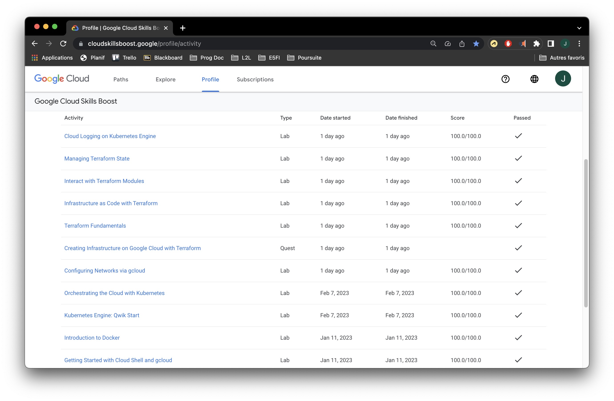

# SY3 - Projet de virtualisation

## Labs Google Cloud Skills Boost

## Projet
Le sujet du projet peut être trouvé [à cette adresse](https://drive.google.com/file/d/1vvI1WEoqA8w1NsDQYf3ZAbzJ6bKpLywh/view?usp=sharing).

### Étape 1 : Déploiement des services

### Étape 2 : Communication entre les services

### Étape 3 : Ajout d'une gateway au cluster

### Étape 4 : Ajout de la base de donnée

### Étape : Déploiement chez un Cloud Provider