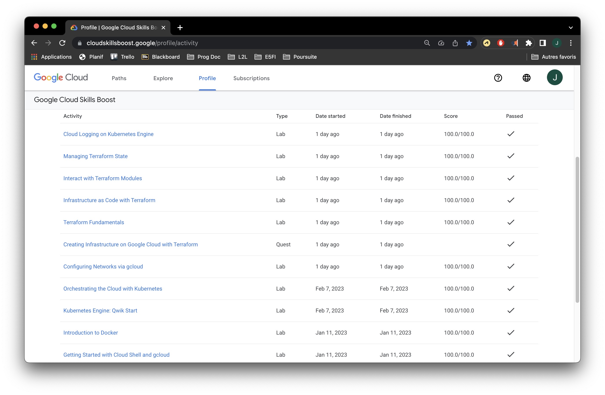
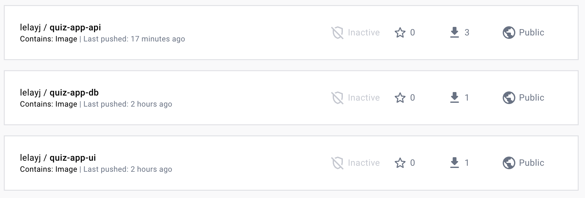
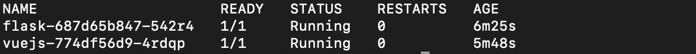
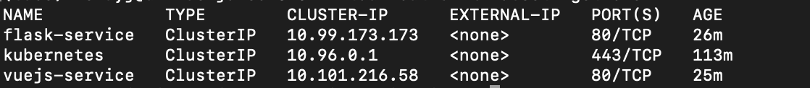

# SY3 - Projet de virtualisation

## Labs Google Cloud Skills Boost


## Projet
Le sujet du projet peut être trouvé [à cette adresse](https://drive.google.com/file/d/1vvI1WEoqA8w1NsDQYf3ZAbzJ6bKpLywh/view?usp=sharing). Le dépôt GitHub du projet peut être trouvé à [l'adresse suivante](https://github.com/LelayJ-ESIEE/5I/tree/SY/SY3).

Celui-ci consiste en un déploiement de l'application développée lors de l'unité Développement Web Front-End de E4FI.

### Étape 1 : Déploiement des services

Clone du projet [quizz-app](https://github.com/LelayJ-ESIEE/quiz-app) et création des Dockerfiles pour les images :
* [quiz-app-api](https://github.com/LelayJ-ESIEE/5I/blob/SY/SY3/SYstemes_d_information/SY3-Virtualisation/src/quiz-api/Dockerfile)
* [quiz-app-ui](https://github.com/LelayJ-ESIEE/5I/blob/SY/SY3/SYstemes_d_information/SY3-Virtualisation/src/quiz-ui/Dockerfile)
* [quiz-app-db](https://github.com/LelayJ-ESIEE/5I/blob/SY/SY3/SYstemes_d_information/SY3-Virtualisation/src/DB/Dockerfile)

Build des images et push sur DockerHub :
```bash
docker build src/quiz-api -t quiz-app-api
docker tag quiz-app-api lelayj/quiz-app-api:1.0
docker push lelayj/quiz-app-api:1.0

docker build src/quiz-ui -t quiz-app-ui
docker tag quiz-app-ui lelayj/quiz-app-ui:1.0
docker push lelayj/quiz-app-ui:1.0

docker build src/DB -t quiz-app-db
docker tag quiz-app-db lelayj/quiz-app-db:1.0
docker push lelayj/quiz-app-db:1.0
```



Démarrage de minikube et déploiement des services.
Pods : 
Services : 

### Étape 2 : Communication entre les services
En cours

### Étape 3 : Ajout d'une gateway au cluster
Ajout de l'ingress : En cours

### Étape 4 : Ajout de la base de donnée
Voir étape 1, DB

### Étape 5 : Déploiement chez un Cloud Provider
Déploiement sur une machine Oracle en cours